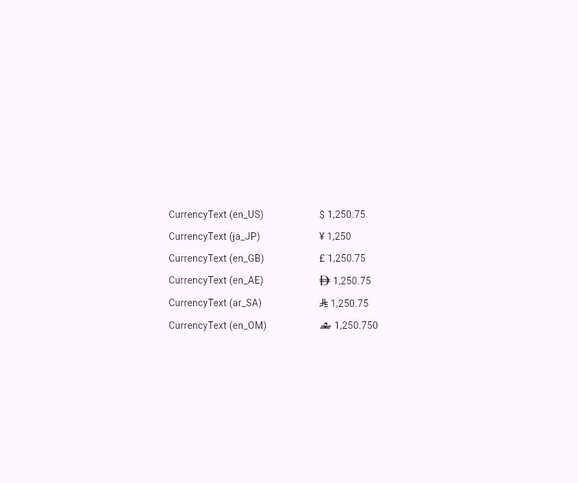

# gulf_currency_formatter

A Flutter currency text package for real apps.

It formats int, double, num, and numeric String values as currency widgets, with built-in symbol-font support for:

- AED (UAE Dirham)
- SAR (Saudi Riyal)
- OMR (Omani Rial)

All other currencies are also supported through locale-driven ISO currency resolution.

## Why this package

- CurrencyText auto-resolves currency from locale.
- AED, SAR, and OMR symbols render with bundled fonts out of the box.
- Great for UI currency display with locale-aware formatting.

## Install

Add this to pubspec.yaml:

```yaml
dependencies:
  gulf_currency_formatter: ^1.0.0
```

Then import:

```dart
import 'package:gulf_currency_formatter/gulf_currency_formatter.dart';
```

## Quick start

### Widget usage (recommended)

```dart
CurrencyText(1250.75, locale: 'en_AE');
CurrencyText(1250.75, locale: 'ar_SA');
CurrencyText(1250.75, locale: 'en_OM');
CurrencyText(1250.75, locale: 'en_US');
```

## Web run screenshot (folder and file name)

When you upload your Flutter web run screenshot, put it in this exact location:

- Folder: assets/screenshots/
- File name: web-run.png
- Full path: assets/screenshots/web-run.png

After adding the image file, keep this line in README so it displays:

```md

```


## Example app

Run the example:

```bash
cd example
flutter run -d chrome
```

## CurrencyText options

Main options available on CurrencyText:

- decimalDigits
- symbolSpacing
- compact
- negativeFormat

## Locale resolution

CurrencyText resolves currency from locale region and then formats with intl.

Examples:

```dart
currencyCodeForLocale('en_AE'); // AED
currencyCodeForLocale('ar_SA'); // SAR
currencyCodeForLocale('en_OM'); // OMR
```

## License

MIT. See LICENSE.
